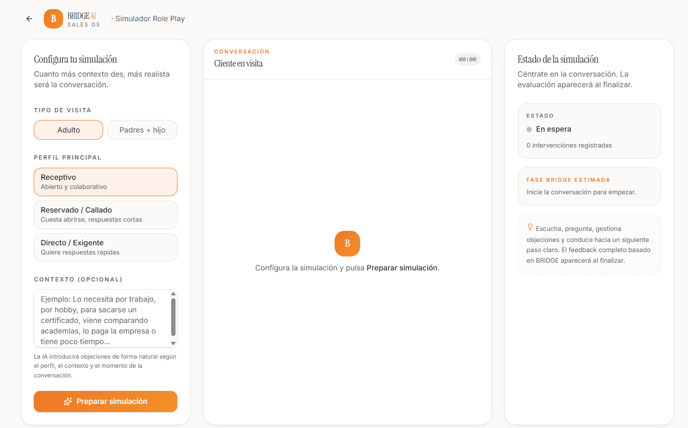

# BRIDGE AI

**AI-powered Consultative Sales Training & Simulation Platform**

An applied AI project designed to help commercial teams practise consultative selling through realistic customer simulations, voice conversations and structured performance feedback.

The platform combines conversational AI, sales methodology and voice interaction to create realistic commercial training scenarios.

## Application Preview

## What the project explores

- AI-powered sales role-play simulations
- Voice-based customer conversations
- Consultative selling methodology
- Customer profile and objection simulation
- Structured sales performance feedback
- Commercial process optimisation
- AI-assisted sales training

## How it works

Users configure a commercial scenario by selecting the customer profile, context, sales objective and potential objection.

The AI then simulates the customer interaction, allowing the salesperson to conduct a realistic sales conversation and receive structured feedback on their performance.

## Technology & AI

The project combines:

- Conversational AI
- Voice interaction
- AI role-play simulation
- Sales methodology
- Structured performance analysis
- Scenario-based training

## Business purpose

BRIDGE AI explores how artificial intelligence can be applied to sales enablement and commercial training, moving beyond theoretical learning towards realistic practice, feedback and continuous improvement.

---

Created by Ramón López Sánchez.
